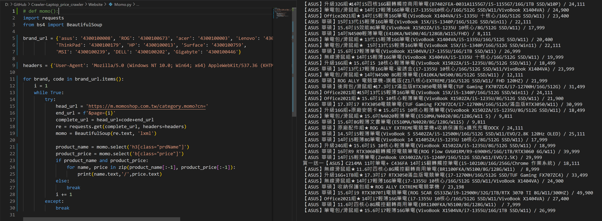
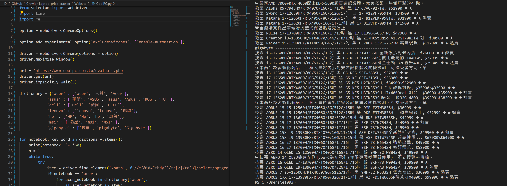

# Momo, Pchome, Coolpc(原價屋)爬蟲

## 目的

因為前一份工作需要常常check競爭對手的規格、價格、通路產品（看有什麼產品該通路特有）等
因此常常需要將網站的資訊複製下來變成ppt檔
但這一來一回當中花了非常多時間

現在藉由這個機會，運用Python來快速獲取網站上的資料，以增加工作效率

## 運用工具

Selenium, Beautifulsoup, requests

## 實際成果

Momo:

Pchome:

Coolpc:

## 困難點

Momo的部分因為桌面板的html較不易爬取，因此採用行動版的部分來爬取

故需要再加上一行header

headers = {'User-Agent': 'Mozilla/5.0 (Windows NT 10.0; Win64; x64) AppleWebKit/537.36 (KHTML, like Gecko) Chrome/81.0.4044.138 Safari/537.36'}
